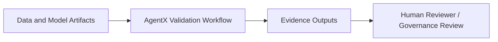
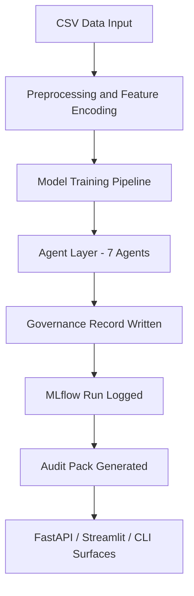
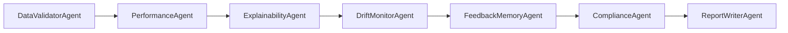
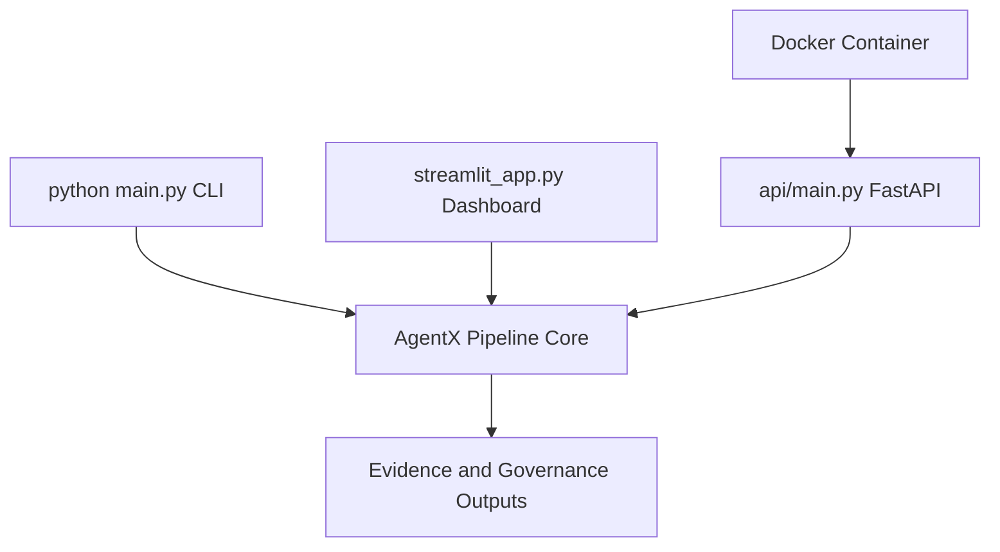
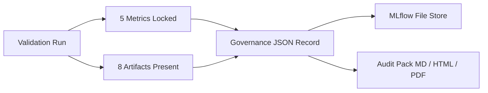
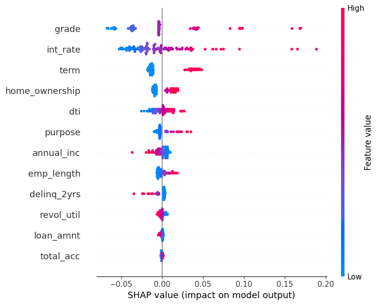

# AgentX: Autonomous Risk Model Validation System


A local autonomous model validation system for credit risk workflows with integrated
performance validation, SHAP explainability, drift monitoring, governance records,
grounded advisory compliance review, MLflow tracking, FastAPI serving, and audit-pack
generation.

---

## System Summary

AgentX validates a credit-risk model through a modular agent workflow. It checks data
quality, model performance, explainability, drift, feedback memory, compliance context,
governance traceability, MLflow run tracking, and audit-pack outputs. It is designed as
a local model validation and governance evidence system.

The system accepts a LendingClub credit portfolio dataset, runs it through a seven-agent
validation pipeline, and produces structured outputs covering all validation dimensions.
Three entry points are supported: a CLI pipeline, an interactive Streamlit dashboard,
and a FastAPI local service boundary.

---

## Quantitative Snapshot

| Category | Detail |
|---|---|
| Dataset | LendingClub public loan sample (2007-2018Q4) |
| Rows | 5,000 |
| Features | 12 |
| Target | Binary `loan_status` (Fully Paid / Charged Off) |
| Class balance | 81% non-default / 19% default |
| Model | `Pipeline(StandardScaler + LogisticRegression)` |
| ROC-AUC | 0.6776 |
| Accuracy | 0.804 |
| Precision | 0.350 |
| Recall | 0.037 |
| F1 | 0.067 |
| Test suite | 268 tests passing, 0 failures |
| API benchmark | GET /health ~2.0 ms median, POST /validate ~2,430 ms median (local in-process) |
| Artifact coverage | 8/8 artifacts present after each pipeline run |
| Docker | Build and smoke test passed (python:3.11-slim, port 8000) |
| Audit pack | Markdown, HTML, and PDF generated per run (fpdf2, markdown2) |

ROC-AUC is the preferred headline metric because the target is imbalanced. Recall
remains a baseline improvement target.

---

## Technology Stack

| Layer | Technologies |
|---|---|
| Data and modeling | Python, pandas, scikit-learn |
| Model pipeline | `Pipeline(StandardScaler + LogisticRegression)` |
| Explainability | SHAP |
| Feedback memory | FAISS (IndexFlatIP, cosine similarity) |
| Compliance reasoning | Groq LLM (llama-3.3-70b-versatile) with grounded local fallback |
| API boundary | FastAPI, Pydantic v2, Uvicorn |
| Testing | pytest |
| Run tracking | MLflow (local file store) |
| Governance evidence | JSON validation-run records, run ID traceability |
| Report generation | Markdown, HTML (markdown2), PDF (fpdf2) |
| Packaging | Docker (python:3.11-slim) |
| Benchmarking | Custom local benchmark script using FastAPI TestClient |

---

## Business Problem

Model validation in credit risk workflows is evidence-intensive. Reviewers need
reproducible metrics, explainability outputs, drift signals, governance traceability,
and structured documentation before a model can advance to review or approval discussions.

When assembled manually, this evidence-gathering phase is slow, inconsistent across
reviewers, and difficult to scale as model inventory grows. AgentX addresses this by
automating the first-pass validation workflow: running a defined agent sequence,
producing structured artifacts on each run, and maintaining a governance record of
every validation cycle.

AgentX does not replace independent validation judgment or regulatory review. It
accelerates and standardizes the evidence-gathering phase that precedes those processes.

---

## System Objective

**Validation automation:** Run a seven-agent pipeline on demand, producing structured
JSON and Markdown outputs for every validation dimension.

**Explainability:** Compute per-prediction SHAP values, generate a global feature
importance plot, and store a normalized model fingerprint in a FAISS index for
similarity retrieval.

**Drift and monitoring evidence:** Apply KS-test drift detection across all numeric
features, comparing a reference dataset to an incoming dataset, and flag shifted
distributions.

**Governance traceability:** Write a structured validation-run record on each pipeline
run, capturing metrics, artifact status, drift results, compliance status, reviewer
placeholder, and risk flags.

**Advisory compliance review:** Build a grounded evidence context from the current run
and pass it to a language model or a local fallback to generate a structured advisory
checklist referencing SR 11-7 and Basel principles.

**Audit pack generation:** Package all evidence into Markdown, HTML, and PDF outputs
per run using pure-Python libraries with no system binary dependency.

---

## System Value

| Capability | What changes operationally |
|---|---|
| Data validation | Surfaces missing values, class imbalance, and feature distribution before model evaluation |
| Performance validation | Produces reproducible, locked metrics from a consistent preprocessing and split pipeline |
| SHAP attribution | Explains model behavior at global level; supports regulatory explainability expectations |
| Drift monitor | Detects feature distribution shifts between reference and incoming datasets |
| Feedback memory | Retrieves historically similar models by SHAP cosine similarity for run-over-run comparison |
| Governance records | Creates per-run traceability with run ID, timestamps, reviewer placeholder, and risk flags |
| MLflow tracking | Preserves metrics, parameters, and artifacts per run in a local file store |
| Audit pack | Packages evidence into reviewable Markdown, HTML, and PDF outputs without manual assembly |

---

## Role in Workflow

AgentX sits between model and data ingestion and the model review or approval discussion.
It accepts a credit portfolio dataset, executes the validation pipeline, and produces
evidence outputs structured for human-in-the-loop review.



Outputs are not reviewed or approved automatically. The `reviewer_status` field in
each governance record is set to `pending_review` on every run.

---

## Architecture

### End-to-End Validation Lifecycle



### Agent Workflow



### Service Boundary



### Governance and Evidence Flow



---

## Agent Layer

| Agent | Responsibility | Evidence Output |
|---|---|---|
| DataValidatorAgent | Missing values, duplicates, class distribution, summary statistics | `data/validation_outputs/data_validation.json` |
| PerformanceAgent | ROC-AUC, accuracy, precision, recall, F1, confusion matrix | `data/validation_outputs/performance_metrics.json` |
| ExplainabilityAgent | SHAP values, mean feature importance vector, normalized FAISS embedding, summary plot | `data/validation_outputs/shap_summary.png` |
| DriftMonitorAgent | KS-test per numeric feature, drift flag, drifted feature list | `data/validation_outputs/drift_report.json` |
| FeedbackMemoryAgent | FAISS inner-product similarity search, historical model comparison by SHAP cosine similarity | `data/model_memory/` |
| ComplianceAgent | Evidence-grounded advisory review referencing SR 11-7 and Basel principles; Groq LLM or grounded local fallback | `data/validation_outputs/last_compliance.json` |
| ReportWriterAgent | Consolidated Markdown validation report from all agent outputs | `reports/validation_report.md` |

---

## Model Evidence

The model is a scikit-learn `Pipeline(StandardScaler + LogisticRegression(max_iter=1000, random_state=42))`.
It is the validation target, not an optimized production scoring model. StandardScaler
is fit on the training split only and stored inside the Pipeline artifact, preventing
preprocessing leakage at inference.

Train/test split: 80/20 stratified, random_state=42. Scaler fit on training set;
applied to test set through the saved Pipeline.

| Metric | Value |
|---|---|
| ROC-AUC | 0.6776 |
| Accuracy | 0.804 |
| Precision | 0.350 |
| Recall | 0.037 |
| F1 Score | 0.067 |

Accuracy of 0.804 reflects the 81% majority class. ROC-AUC of 0.6776 is the preferred
headline metric: it is threshold-independent and resistant to class imbalance. Recall of
0.037 is a documented baseline characteristic of unweighted logistic regression on an
81/19 imbalanced target. Class-weighted and tree-based model variants are planned
extensions.

Full evidence: `docs/evidence/verified_metrics.md` and `docs/evidence/verified_metrics.json`.

---

## Explainability and Feedback Memory

The ExplainabilityAgent computes SHAP values for a 100-row sample per run. A global
feature importance summary plot is saved to `data/validation_outputs/shap_summary.png`
and displayed in the Streamlit dashboard Explainability page.

The normalized mean SHAP vector is stored in a FAISS inner-product index
(`data/model_memory/`) as a model fingerprint. On each validation run, the
FeedbackMemoryAgent retrieves the most similar historical models by cosine similarity.
This supports:

- Tracking how feature attribution shifts across model versions
- Identifying whether a new submission behaves similarly to previously validated models
- Building a model lineage record across validation cycles



*Real SHAP global feature importance generated by the AgentX validation pipeline,
ranking the strongest drivers in the credit risk validation workflow by mean absolute
SHAP value across the 100-row validation sample.*

---

## Drift Monitoring

The DriftMonitorAgent applies the Kolmogorov-Smirnov two-sample test to each numeric
feature, comparing a reference dataset to an incoming dataset. Features with a p-value
below 0.05 are flagged as drifted.

A simulated drift dataset (`data/drift_test/incoming_drifted_data.csv`) was generated
by inflating `annual_inc` and shifting `loan_amnt` distributions. Under simulated
conditions, both features confirmed drift with p-value = 0.0.

Drift results are written to `data/validation_outputs/drift_report.json` and
visualized in the Streamlit dashboard Drift Detection page. This is a local validation
signal; it does not represent live production monitoring.

---

## Governance Evidence

Each pipeline run writes a structured JSON validation-run record:

- `data/governance/validation_runs/{run_id}.json` for each individual run
- `data/governance/latest_validation_run.json` as a pointer to the most recent run

| Record Field | Description |
|---|---|
| `validation_run_id` | Unique ID: `vrun_YYYYMMDD_HHMMSS_xxxxxxxx` |
| `created_at_utc` | ISO 8601 UTC timestamp |
| `metrics_snapshot` | ROC-AUC, accuracy, precision, recall, F1 |
| `drift_status` | Drift detected flag, drifted feature list |
| `compliance_status` | Compliance advisory source and summary |
| `artifact_status` | Existence and size of each output artifact |
| `reviewer_status` | Placeholder: `pending_review` |
| `risk_flags` | Auto-populated flags such as drift warnings |
| `claim_safety_note` | Scoped system boundary note |

This is an MCP-style validation-run traceability prototype. Records are local-only
and excluded from version control.

API access: `GET /governance/latest` and `GET /governance/history`.

**Sample governance record (real output from `GET /governance/latest`):**

```json
{
  "validation_run_id": "vrun_20260521_012102_1417e870",
  "created_at_utc": "2026-05-21T01:21:02.846617+00:00",
  "roc_auc": 0.6776,
  "drift_detected": true,
  "drifted_features": ["loan_amnt", "annual_inc"],
  "reviewer_status": "pending_review",
  "risk_flags": ["Feature drift detected in: loan_amnt, annual_inc"],
  "compliance_status": "completed_advisory",
  "artifacts_present": 8,
  "artifacts_total": 8
}
```

---

## Grounded Advisory Compliance Review

The ComplianceAgent builds a structured evidence context before each compliance review.
The context includes actual values from the current run: verified ROC-AUC, accuracy,
recall, class balance, drift status, governance run ID, artifact inventory, and
benchmark summary.

When a Groq API key is configured, the evidence context is injected into the LLM
system prompt. The LLM is instructed to cite specific evidence values, not produce
generic commentary.

When the Groq API is unavailable, a grounded local fallback advisory is generated
using the same evidence context. Both paths produce a structured checklist referencing
SR 11-7 and Basel validation principles with actual model values cited.

The compliance output is advisory only. It does not constitute regulatory approval,
regulatory certification, or a production compliance determination. Reference frameworks
are included at `docs/sr11_7_summary.md` and `docs/basel_guidelines_summary.md`.

---

## MLflow Validation Tracking

Each pipeline run logs to a local MLflow file store (`mlruns/`) under the experiment
`agentx_risk_validation`:

| Category | Logged Items |
|---|---|
| Metrics (5) | roc_auc, accuracy, precision, recall, f1_score |
| Parameters (8) | dataset_rows, feature_count, model_type, target, class_balance, test_size, random_state, validation_run_id |
| Artifacts (up to 8) | verified_metrics.json, verified_metrics.md, benchmark_results.json, benchmark_report.md, shap_summary.png, governance record, compliance output, drift report |

Tracking URI uses `Path.as_uri()` to produce a `file:///` URI, required on Windows.
Tracking failure is caught and does not stop the pipeline.

`mlruns/` and `mlartifacts/` are excluded from git. This is local development tracking
only. No remote server, no model registry.

---

## Audit Pack Generation

Each pipeline run generates a local audit pack at `reports/audit_pack/`:

| Output | Format | Library |
|---|---|---|
| `audit_pack.md` | Markdown | stdlib |
| `audit_pack.html` | HTML with embedded CSS | markdown2 |
| `audit_pack.pdf` | PDF | fpdf2 (pure Python) |
| `audit_pack_context.json` | Machine-readable context | stdlib |

The audit pack includes: verified metrics, dataset summary, drift status, compliance
advisory summary, governance run ID, benchmark summary, MLflow tracking status,
limitations, and a scope note.

PDF generation uses fpdf2 with no system binary dependency. No pdfkit or wkhtmltopdf
required. Audit pack outputs are excluded from git.

---

## API Surface

| Method | Endpoint | Purpose |
|---|---|---|
| GET | `/health` | System liveness and file availability check |
| GET | `/metrics` | Verified model performance metrics from evidence file |
| GET | `/evidence` | Evidence file inventory and artifact status |
| POST | `/validate` | Run the full validation pipeline |
| GET | `/governance/latest` | Most recent validation-run governance record |
| GET | `/governance/history` | List of recent validation-run summaries |

**Start the API:**

```bash
uvicorn api.main:app --host 0.0.0.0 --port 8000
```

**Health check:**

```bash
curl http://localhost:8000/health
```

```json
{
  "status": "ok",
  "system": "AgentX Risk Validator",
  "version": "1.0.0",
  "metrics_available": true,
  "evidence_available": true
}
```

**Verified metrics:**

```bash
curl http://localhost:8000/metrics
```

```json
{
  "roc_auc": 0.6776,
  "accuracy": 0.804,
  "precision": 0.35,
  "recall": 0.0368,
  "f1_score": 0.0667,
  "dataset_rows": 5000,
  "feature_count": 12,
  "model_type": "sklearn Pipeline: StandardScaler + LogisticRegression(max_iter=1000, random_state=42)",
  "evidence_source": "docs/evidence/verified_metrics.json"
}
```

**Trigger validation:**

```bash
curl -X POST http://localhost:8000/validate \
  -H "Content-Type: application/json" \
  -d '{"run_compliance_agent": false, "run_drift_monitor": true, "regenerate_reports": true}'
```

Set `run_compliance_agent` to `true` when `GROQ_API_KEY` is configured. The pipeline
uses the grounded fallback advisory when the key is absent.

All six endpoints are covered by 41 tests in `tests/test_api.py`.

---

## Benchmark Evidence

| Measurement | Median | Notes |
|---|---|---|
| GET /health | ~2.0 ms | In-process TestClient, 30 iterations |
| GET /metrics | ~2.6 ms | In-process TestClient, 30 iterations |
| GET /evidence | ~4.3 ms | In-process TestClient, 30 iterations |
| POST /validate | ~2,430 ms | Full 7-agent pipeline per call, 3 iterations |
| Pipeline direct | ~2,470 ms | Full pipeline including SHAP, FAISS, and drift |
| Docker smoke test | Passed | GET /health returns `status: ok`; GET /metrics returns ROC-AUC 0.6776 |

These are local development measurements taken on Windows 11 with Python 3.13.1 and
an Intel Core Ultra processor. They reflect in-process TestClient calls with no network
overhead. They are not cloud, container, or production latency figures.

Machine-readable results: `docs/evidence/benchmark_results.json`.
Human-readable report: `docs/evidence/benchmark_report.md`.

---

## Test Coverage

268 fast tests passing, 0 failures.

| Test File | Tests | Coverage Area |
|---|---|---|
| `test_config.py` | 10 | Path constants, PROJECT_ROOT derivation |
| `test_data_pipeline.py` | 11 | Preprocessing, class balance, feature count |
| `test_model_pipeline.py` | 14 | Training, Pipeline structure, ROC-AUC regression guard |
| `test_agents.py` | 36 | All 7 agents, grounded compliance tests |
| `test_artifacts.py` | 18 | Artifact existence and schema validation |
| `test_api.py` | 41 | All 6 endpoints, governance endpoint tests |
| `test_benchmark_script.py` | 16 | Benchmark imports, output file schema |
| `test_governance.py` | ~60 | Governance utility functions, write/load round-trips |
| `test_compliance_context.py` | ~39 | Context builder functions, no-secrets assertions |
| `test_mlflow_tracking.py` | 25 | MLflow configure, log, artifacts, summary |
| `test_audit_pack.py` | 31 | Audit context, MD/HTML/PDF generation, graceful degradation |
| `test_main_smoke.py` | 3 | Full pipeline subprocess smoke (marked slow, excluded from fast suite) |

Run the fast suite:

```bash
python -m pytest -m "not slow"
```

ROC-AUC 0.6776 is locked as a numerical regression guard in `test_api.py` and
`test_governance.py`. If a code change produces a different AUC, these tests fail.

---

## Engineering Decisions

**sklearn Pipeline for preprocessing consistency:** StandardScaler is fit on the
training split and stored inside the Pipeline artifact. This eliminates the risk of
scaler refit on test data, which was producing inconsistent metrics in earlier iterations.
The root cause analysis is documented in `docs/evidence/metric_inconsistency_diagnosis.md`.

**Centralized path management via config.py:** All file paths are defined as
`pathlib.Path` constants in `utils/config.py`. Agent, API, and utility code imports
from config rather than using hardcoded strings, keeping the project portable across
machines and test environments.

**Structured logging:** All pipeline steps use Python's `logging` module with a
consistent format. Log output is structured and suppressible in tests without patching
print statements.

**FastAPI added after test suite:** The API boundary was introduced after the core
pipeline had test coverage. API service functions are thin adapters over existing
pipeline functions; no agent logic is duplicated in the API layer.

**MLflow integrated with graceful degradation:** Step 13 of the pipeline is wrapped
in a try/except block. MLflow tracking failures log a warning and append to the result
warnings list without stopping the pipeline. This allows the system to run in
environments without MLflow configured.

**Audit pack added as the final pipeline step:** The audit pack assembles evidence
from all prior pipeline steps. Introducing it as Step 14 ensures the governance record,
compliance output, and MLflow run are all available for inclusion in the same pass.

**Generated artifacts excluded from git:** `data/`, `reports/`, `mlruns/`, and
`mlartifacts/` are excluded via `.gitignore`. This keeps the repository focused on
source and evidence documentation while preventing large binary and generated files
from accumulating in git history.

---

## System Scope and Boundaries

AgentX is designed as a local model validation and governance evidence system. It
demonstrates multi-agent validation, explainability, drift monitoring, FastAPI serving,
Docker packaging, benchmark evidence, governance run records, grounded advisory
compliance review, MLflow tracking, and audit-pack generation.

The current implementation operates on a 5,000-row public dataset sample. It is not
positioned as a production regulatory approval platform, live banking deployment, or
externally deployed enterprise service. Detailed scope notes are maintained in
`docs/evidence/claim_safety.md`.

---

## Repository Structure

```
api/                  FastAPI boundary: schemas, service adapters, route handlers
agents/               Seven validation agents
utils/                Config, logging, governance, compliance context, MLflow, audit pack
tests/                268-test suite organized by module
scripts/              Benchmark script
docs/
  evidence/           Engineering evidence, verified metrics, benchmark, governance,
                      compliance, MLflow, audit pack, system inventory, and gap reports
  sr11_7_summary.md
  basel_guidelines_summary.md
main.py               CLI pipeline entry point (run_agentx_pipeline callable)
streamlit_app.py      8-page interactive validation dashboard
Dockerfile            Docker build (python:3.11-slim, port 8000)
requirements.txt
.env.example          Safe placeholder configuration
```

`data/`, `reports/`, `mlruns/`, and `mlartifacts/` are excluded from git.

---

## Getting Started

**Create environment:**

```bash
python -m venv .venv
source .venv/bin/activate      # Linux / macOS
.venv\Scripts\activate         # Windows
pip install -r requirements.txt
```

**Configure environment variables:**

```bash
cp .env.example .env
# Add GROQ_API_KEY to .env if using the compliance agent.
# The pipeline runs without a key using the grounded fallback advisory.
```

Never commit `.env`. It is excluded from git by `.gitignore`.

**Run the CLI validation pipeline:**

```bash
python main.py
```

Runs all seven agents, writes validation outputs to `data/validation_outputs/`,
writes governance record to `data/governance/`, logs an MLflow run to `mlruns/`,
and generates an audit pack to `reports/audit_pack/`.

**Run the FastAPI service:**

```bash
uvicorn api.main:app --host 0.0.0.0 --port 8000
```

**Run the Streamlit dashboard:**

```bash
streamlit run streamlit_app.py
```

Opens an 8-page validation interface: Upload, Overview, Performance, Explainability,
Compliance, Drift, Export, and Compare Models.

**Run the test suite:**

```bash
python -m pytest -m "not slow"
```

**Run the benchmark:**

```bash
python scripts/benchmark_agentx.py
```

Outputs: `docs/evidence/benchmark_results.json` and `docs/evidence/benchmark_report.md`.

**Run the Docker container:**

```bash
docker build -t agentx-risk-validator .
docker run --rm -p 8000:8000 agentx-risk-validator
# With Groq key for compliance agent:
docker run --rm -p 8000:8000 --env-file .env agentx-risk-validator
```

---

## Evidence Index

| Document | Content |
|---|---|
| `docs/evidence/final_evidence_consolidation_report.md` | Complete engineering wave summary and current architecture |
| `docs/evidence/portfolio_summary.md` | System capability and evidence summary |
| `docs/evidence/verified_metrics.md` | Locked baseline metrics with confusion matrix |
| `docs/evidence/benchmark_report.md` | Local endpoint and pipeline latency measurements |
| `docs/evidence/governance_evidence_report.md` | Governance record schema and API endpoints |
| `docs/evidence/compliance_grounding_report.md` | Compliance agent grounding design and evidence sources |
| `docs/evidence/mlflow_tracking_report.md` | MLflow configuration, metrics/params/artifacts logged per run |
| `docs/evidence/audit_pack_report.md` | Audit pack design, formats, and GAP-014 resolution |
| `docs/evidence/claim_safety.md` | Detailed scope and system boundary notes |

---

## Engineering Roadmap

**Completed:**

- Security hygiene and metric pipeline correction (Phase 5B.1)
- Evidence documentation and README (Phase 5B.2)
- Config-driven paths and structured logging (Phase 5B.3)
- 268-test suite with ROC-AUC regression guard (Phases 5B.4 to 5B.9)
- FastAPI boundary and Docker packaging (Phase 5B.5)
- Local benchmark evidence with machine-readable output (Phase 5B.6A)
- Governance validation-run records and API endpoints (Phase 5B.6B)
- Evidence-grounded compliance advisory with local fallback (Phase 5B.6C)
- Git initialization and evidence consolidation (Phases 5B.6D to 5B.7)
- Local MLflow validation tracking with graceful degradation (Phase 5B.8)
- Portable audit pack generation in MD, HTML, and PDF (Phase 5B.9)

**Possible extensions:**

- Class-weighted LogisticRegression or XGBoost for improved recall on the default class
- Richer PDF audit pack styling with table rendering
- Drift-triggered automatic revalidation workflow
- Hosted demo deployment after full security review
- Portfolio case study with evidence linkage

---

## Dataset Citation

LendingClub Loan Data, 2007-2018Q4.
Source: Kaggle / LendingClub public loan dataset.
Filtered to binary classification: Fully Paid vs Charged Off.
Sample: 5,000 rows, random_state=42.
No personally identifiable information present in the 12 features used.

---

## Author

**Ijaz Kakkod**
Machine Learning Systems | Explainable AI | Model Governance

[](https://github.com/IjazKakkodDS)
[](https://www.linkedin.com/in/ijazkakkod)